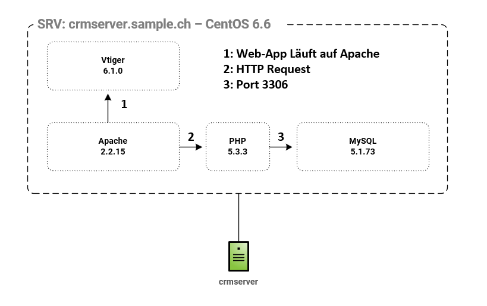

# Auftrag #2 – Architekturdiagramm IST/SOLL

## IST-Diagramm

### IST-Zustand
- SRV: crmserver.sample.ch – CentOS 6.6
- Apache 2.2.15 führt Vtiger-PHP-Code aus
- PHP 5.3.3 verarbeitet Anfragen und kommuniziert mit der Datenbank
- MySQL 5.1.73 speichert alle CRM-Daten (Port 3306)

## SOLL-Diagramm

### SOLL-Zustand
- SRV: crmserver.sample.ch – Ubuntu 22.04 LTS
- UFW Firewall: nur Port 22, 80, 443 offen
- Apache 2.4.x führt Vtiger-PHP-Code aus
- PHP 8.2.x verarbeitet Anfragen und kommuniziert mit der Datenbank
- MariaDB 10.x speichert alle CRM-Daten (Port 3306)
- Vtiger 7.x als aktualisierte CRM-Applikation

## Vergleich IST / SOLL

| Komponente | IST | SOLL | Grund |
|------------|-----|------|-------|
| OS | CentOS 6.6 | Ubuntu 22.04 | CentOS EOL, Ubuntu LTS bis 2027 |
| Webserver | Apache 2.2.15 | Apache 2.4.x | EOL, Sicherheit und Performance |
| PHP | 5.3.3 | 8.2.x | EOL, Vtiger 7 benötigt PHP 7.4+ |
| Datenbank | MySQL 5.1.73 | MariaDB 10.x | EOL, MariaDB aktiv weiterentwickelt |
| CRM | Vtiger 6.1.0 | Vtiger 7.x | EOL, aktuelle Version |
| Firewall | keine | UFW | Sicherheit erhöhen |