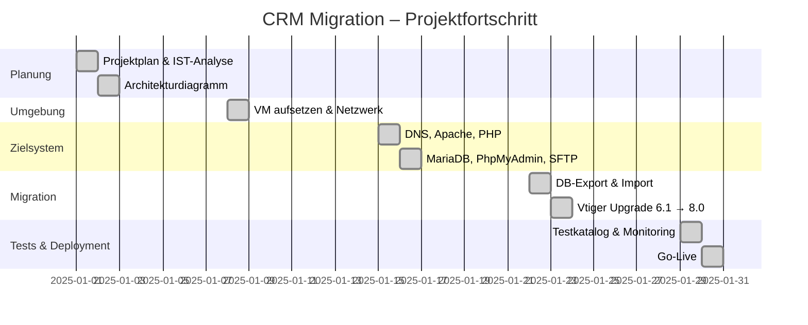

# Arbeitsjournal – CRM Migration

## Projektfortschritt



---

## Tag 1 – Planung

### Ziel
Projektplanung abschliessen, IST-System analysieren und dokumentieren, GitHub Repo aufsetzen.

### SSH-Zugang zum IST-System

Der erste Versuch, per PuTTY auf die IST-VM (CentOS 6.6) zuzugreifen, schlug fehl.
Verschiedene Netzwerkadapter wurden getestet:

| Adapter | Ergebnis |
|---------|----------|
| Realtek USB GbE (Netzwerkbrücke) | `NO-CARRIER` – keine Verbindung |
| Intel WiFi 6E (Netzwerkbrücke) | Keine IP erhalten |
| Host-only Adapter | Keine IP erhalten |
| **NAT mit Port-Forwarding** | ✅ Verbindung erfolgreich |

Da CentOS 6.6 sehr alt ist, lehnt ein moderner SSH-Client die veralteten Key-Algorithmen standardmässig ab. Lösung:

```bash
ssh -o HostKeyAlgorithms=+ssh-rsa \
    -o PubkeyAcceptedAlgorithms=+ssh-rsa \
    root@localhost -p 2222
```

### IST-Analyse

Nach erfolgreichem SSH-Zugang wurde das System analysiert:

```bash
cat /etc/redhat-release   # CentOS release 6.6 (Final)
httpd -v                  # Apache/2.2.15
php -v                    # PHP 5.3.3
mysql --version           # MySQL 5.1.73
mysql -u root -p -e "SELECT * FROM vtiger_version;" vtigercrm
```

```
+----+-------------+-----------------+
| id | old_version | current_version |
+----+-------------+-----------------+
|  1 | 6.1.0       | 6.1.0           |
+----+-------------+-----------------+
```

**Erkenntnis:** Alle Komponenten sind End-of-Life. Eine Migration ist dringend notwendig.

### Architekturdiagramm & Netzwerkplanung

IST/SOLL-Diagramm erstellt. Für die spätere Kommunikation zwischen den VMs wurde folgendes Netzwerk geplant:

```
Subnetz: 192.168.10.0/24 | Gateway: 192.168.10.1 | SOLL-IP: 192.168.10.x
```

### GitHub Repo

Repo-Struktur mit allen Ordnern und Platzhalter-Files aufgesetzt und gepusht.

---

## Tag 2 – Umgebung

### Ziel
Neue SOLL-VM aufsetzen, Netzwerk konfigurieren, Umgebung für Migration vorbereiten.

### VM-Installation

In VMware Workstation Pro wurde eine neue VM mit **Ubuntu 24.04.2 LTS** installiert.
Der Wechsel von Oracle VirtualBox (IST) zu VMware Workstation Pro (SOLL) war bewusst gewählt,
da VMware eine bessere Performance und stabilere Netzwerkkonfiguration bietet.

| Parameter | Wert |
|-----------|------|
| OS | Ubuntu 24.04.2 LTS (Noble Numbat) |
| Hypervisor | VMware Workstation Pro |
| Netzwerkadapter | Bridged (LAN-Port) |
| IP | 192.168.10.x (statisch) |
| Gateway | 192.168.10.1 |
| DNS | 8.8.8.8 |

### MikroTik Firewall

Im Netzwerk wurde eine MikroTik-Firewall eingebunden, welche sämtlichen
eingehenden Traffic von aussen blockiert. Die interne Kommunikation im
Subnetz 192.168.10.0/24 bleibt uneingeschränkt.

### Snapshots

Direkt nach der Grundinstallation wurde der erste Snapshot erstellt.
Snapshots wurden fortan vor jedem kritischen Konfigurationsschritt angelegt,
um bei Fehlern auf einen stabilen Zustand zurückgreifen zu können.

### Verlauf

Die Ubuntu-Installation verlief dank bestehender Erfahrung problemlos.
Netzwerk, SSH und Grundkonfiguration wurden ohne Komplikationen abgeschlossen.

---

## Tag 3 – Zielsystem

### Ziel
Alle benötigten Dienste installieren und konfigurieren: DNS, Apache, PHP, MariaDB, PhpMyAdmin, SFTP.

### DNS

Lokale Namensauflösung via `/etc/hosts` eingerichtet.
`.internal` als Domain-Suffix gewählt (empfohlene Alternative zu `.local`):

```
192.168.10.x    crmserver.internal.ch
```

### Apache 2.4.62

Apache installiert, VirtualHost für `crmserver.internal.ch` konfiguriert.
HTTP → HTTPS Redirect eingerichtet. Self-Signed SSL-Zertifikat erstellt
(Let's Encrypt nicht möglich für `.internal.ch`).
Module `rewrite`, `ssl` und `headers` aktiviert.

### PHP 8.3

PHP 8.3 mit allen für Vtiger benötigten Extensions installiert:
`php-mysql`, `php-xml`, `php-curl`, `php-zip`, `php-gd`, `php-mbstring`, `php-imap`, `php-soap`, `php-bcmath`, `php-intl`.
`php.ini` angepasst: `memory_limit`, Upload-Limits, Zeitzone auf `Europe/Zurich`.

### MariaDB 11.4 LTS

MariaDB installiert, `mysql_secure_installation` durchgeführt.
Datenbank `vtigercrm` mit UTF-8mb4 erstellt.
Dedizierter User `vtiger@localhost` mit Zugriff nur auf diese Datenbank angelegt.
`bind-address = 127.0.0.1` – kein externer DB-Zugriff möglich.

### PhpMyAdmin & SFTP

PhpMyAdmin installiert, Zugriff auf `192.168.10.0/24` beschränkt.
SFTP-User mit Chroot-Jail eingerichtet – kein Shell-Zugang, kein Zugriff ausserhalb des Home-Verzeichnisses.

---

## Tag 4 – Migration

### Ziel
Daten vom IST-System übertragen, Vtiger schrittweise von 6.1.0 auf 8.0 upgraden.

### Problem: Webinterface zeigt nur HTML-Quellcode

Bei der ersten Installation von Vtiger 6.1.0 auf dem neuen System wurde im Browser
nur der rohe HTML-Quellcode angezeigt statt der Applikation. Ursache war eine
fehlerhafte PHP-Apache-Integration.

**Lösung:** Vtiger komplett deinstalliert, mit Version 6.4 neu begonnen und
alle PHP-Extensions nachinstalliert. Danach funktionierte das Webinterface korrekt.

### Datenbankdump

```bash
# IST-System
mysqldump -u root -p vtigercrm > /tmp/vtigercrm_backup.sql
# Transfer via SFTP auf SOLL-System, dann Import:
sudo mariadb -u root -p --default-character-set=utf8 vtigercrm < vtigercrm_backup.sql
```

### Vtiger Upgrade 6.4 → 8.0

Der Upgrade erfolgte in 8 Einzelschritten via dem eingebauten Vtiger Migrations-Wizard (`/migrate`).
Für jeden Schritt: Patch herunterladen → entpacken → Wizard aufrufen → Log prüfen → Snapshot.

```
6.4 → 6.5 → 7.0 → 7.1 → 7.2 → 7.3 → 7.4 → 7.5 → 8.0
```

**Problem beim Schritt 7.4 → 8.0:** Der Migrations-Wizard war nicht erreichbar (HTTP 500).
Ursache: PHP 8.3 inkompatibel für diesen Upgrade-Schritt.
Lösung: Temporär auf PHP 7.4 gewechselt, Upgrade durchgeführt, danach zurück auf PHP 8.3.

---

## Tag 5 – Tests & Deployment

### Ziel
Migration vollständig testen, Monitoring einrichten, Go-Live durchführen.

### Testing

25 Testfälle durchgeführt, gegliedert in 5 Kategorien:
- Netzwerk & Erreichbarkeit (T01–T05)
- Dienste (T06–T10)
- Datenbank (T11–T14)
- Vtiger CRM Funktionen (T15–T23)
- Backup (T24–T25)

**Ergebnis: 25/25 bestanden ✅**

### Monitoring

**Monit** als leichtgewichtiges Monitoring-Tool installiert.
Überwacht Apache, MariaDB, SSH und Speicherplatz.
E-Mail-Alarmierung bei Ausfall konfiguriert.
Automatischer Neustart (Watchdog) aktiv.

### Go-Live

Deployment ausserhalb der Geschäftszeiten durchgeführt:

1. Benutzer per E-Mail informiert
2. IST-System gestoppt (kein weiterer Schreibzugriff)
3. Finalen DB-Dump erstellt und importiert
4. `hosts`-Einträge auf SOLL-System umgestellt
5. Funktionstest bestanden
6. IST-VM als Archiv-Snapshot gesichert

| Kennzahl | Wert |
|----------|------|
| Downtime | ca. 15 Minuten |
| Datenverlust | Keiner |
| Rollback notwendig | Nein |

<sub>Hinweis: Diagramme, Rechtschreibung und Repo-Struktur wurden mit Claude AI Pro generiert.</sub>
