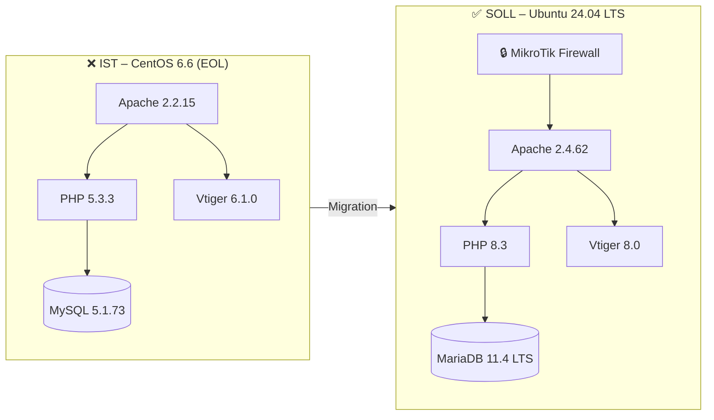

# CRM Migration – crmserver.internal.ch


## Projektbeschreibung
Migration des bestehenden CRM-Systems auf ein neues Betriebssystem mit aktuellem Web- und Datenbankserver. Die CRM-Applikation Vtiger wird auf die neueste Version aktualisiert und alle Daten vollständig migriert.

---

## Architektur



---

## Migrationspfad


---

## Ziele
- Migration auf Ubuntu 24.04 LTS mit neuem Web/DB Server
- Vtiger auf neueste Version aktualisieren
- Vollständige Datenmigration
- Sicherheit erhöhen durch Firewall und aktuelle Softwareversionen

## Projektphasen
| Phase | Inhalt | Aufträge | Status |
|-------|--------|----------|--------|
| Tag 1 | Planung | [#1](01_Planung/Projektplan.md), [#2](01_Planung/Architekturdiagramm.md) | ✅ |
| Tag 2 | Umgebung | [#3](02_Umgebung/Umgebung.md) | ✅ |
| Tag 3 | Zielsystem | [#4](03_Zielsystem/DNS.md), [#5](03_Zielsystem/Webserver.md), [#6](03_Zielsystem/PHP.md), [#7](03_Zielsystem/Mariadb.md), [#8](03_Zielsystem/PhpMyAdmin.md), [#9](03_Zielsystem/SFTP.md) | ✅ |
| Tag 4 | Migration | [#10](04_Migration/Migration.md), [#11](04_Migration/Backup.md) | ✅ |
| Tag 5 | Tests | [#12](05_Tests/Testkatalog.md), [#13](05_Tests/Monitoring.md), [#14](05_Tests/Deployment.md) | ✅ |

## Aufträge
| Nr | Auftrag | Datei |
|----|---------|-------|
| #1 | Projektplan | [01_Planung/Projektplan.md](01_Planung/Projektplan.md) |
| #2 | Architekturdiagramm IST/SOLL | [01_Planung/Architekturdiagramm.md](01_Planung/Architekturdiagramm.md) |
| #3 | Umgebung aufbauen/einrichten | [02_Umgebung/Umgebung.md](02_Umgebung/Umgebung.md) |
| #4 | DNS | [03_Zielsystem/DNS.md](03_Zielsystem/DNS.md) |
| #5 | Webserver | [03_Zielsystem/Webserver.md](03_Zielsystem/Webserver.md) |
| #6 | PHP | [03_Zielsystem/PHP.md](03_Zielsystem/PHP.md) |
| #7 | MySQL/MariaDB-Datenbankserver | [03_Zielsystem/Mariadb.md](03_Zielsystem/Mariadb.md) |
| #8 | PhpMyAdmin/Adminer | [03_Zielsystem/PhpMyAdmin.md](03_Zielsystem/PhpMyAdmin.md) |
| #9 | SFTP oder FTPS-Zugang | [03_Zielsystem/SFTP.md](03_Zielsystem/SFTP.md) |
| #10 | CRM-Migration | [04_Migration/Migration.md](04_Migration/Migration.md) |
| #11 | Backup | [04_Migration/Backup.md](04_Migration/Backup.md) |
| #12 | Testing | [05_Tests/Testkatalog.md](05_Tests/Testkatalog.md) |
| #13 | Monitoring | [05_Tests/Monitoring.md](05_Tests/Monitoring.md) |
| #14 | Deployment | [05_Tests/Deployment.md](05_Tests/Deployment.md) |

## Repo-Struktur
```
M158-LB2/
├── README.md
├── Arbeitsjournal.md
├── 00_Files/
│   ├── Diagramme/
│   └── Screenshots/
├── 01_Planung/
│   ├── Projektplan.md
│   ├── IST-Analyse.md
│   └── Architekturdiagramm.md
├── 02_Umgebung/
│   └── Umgebung.md
├── 03_Zielsystem/
│   ├── DNS.md
│   ├── Webserver.md
│   ├── PHP.md
│   ├── Mariadb.md
│   ├── PhpMyAdmin.md
│   └── SFTP.md
├── 04_Migration/
│   ├── Migration.md
│   └── Backup.md
└── 05_Tests/
    ├── Testkatalog.md
    ├── Monitoring.md
    └── Deployment.md
```

---

$\textcolor{#8b949e}{\text{Hinweis: Diagramme, Rechtschreibung und Repo-Struktur wurden mit }} 
\textcolor{#D4622A}{\text{Claude AI Pro}} 
\textcolor{#8b949e}{\text{ generiert. Die Rechtschreibung wurde bei allen Files auf einmal mit folgendem Prompt korrigiert:}}$

$\textcolor{#D4622A}{\text{"Verbessere alle folgenden Sätze in Bezug auf Gross-/Kleinschreibung und korrigiere grössere Formulierungsfehler."}}$
